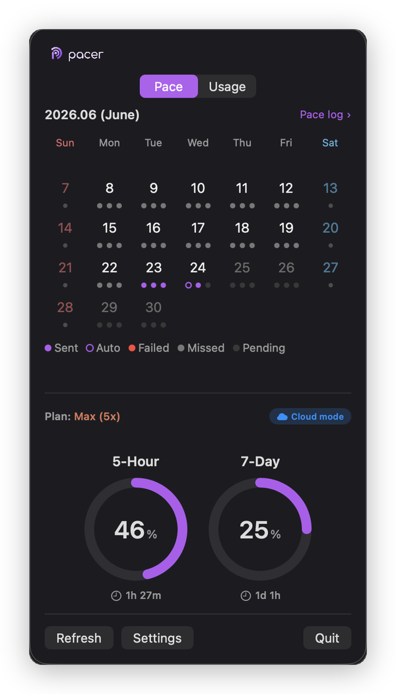
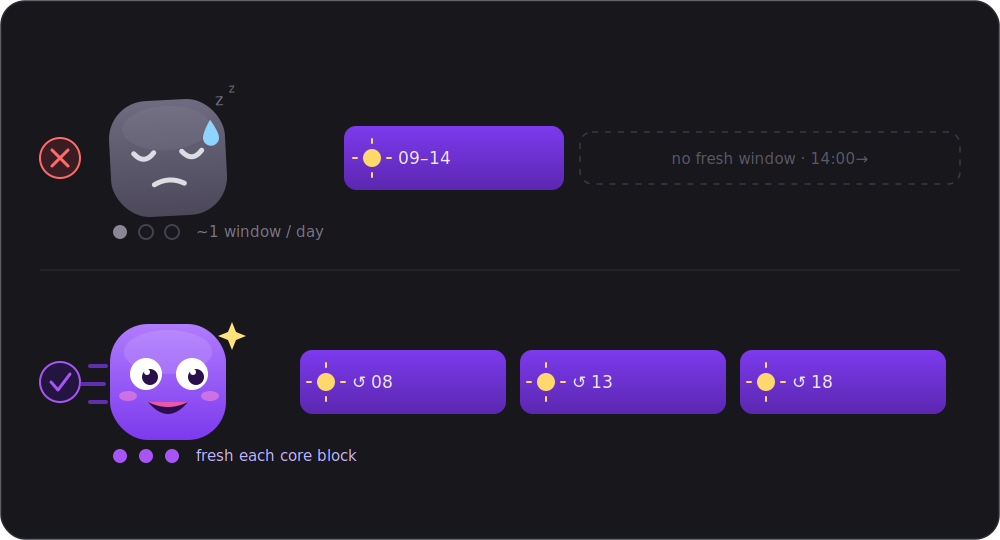
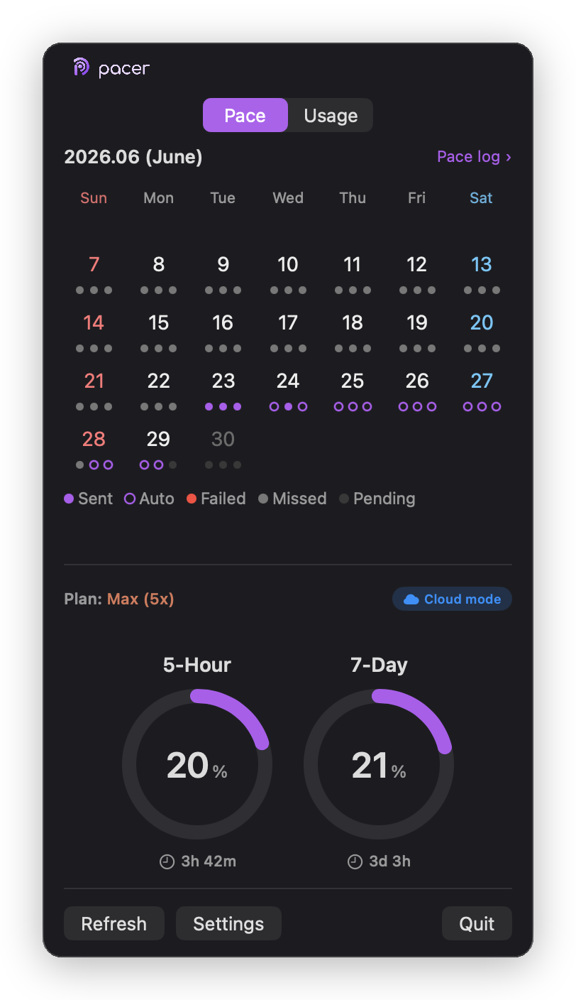
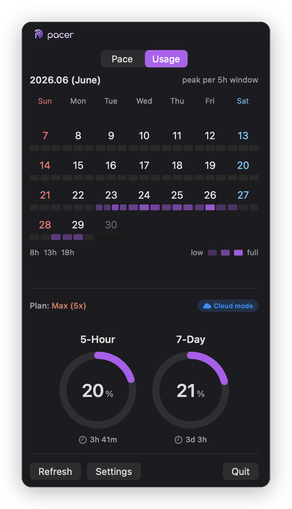
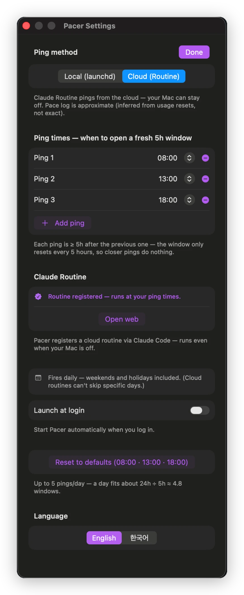
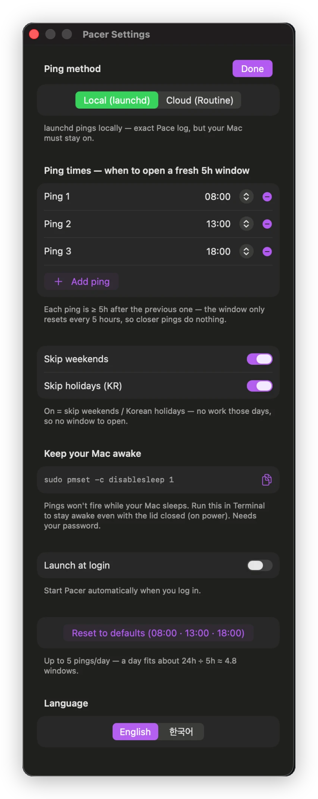
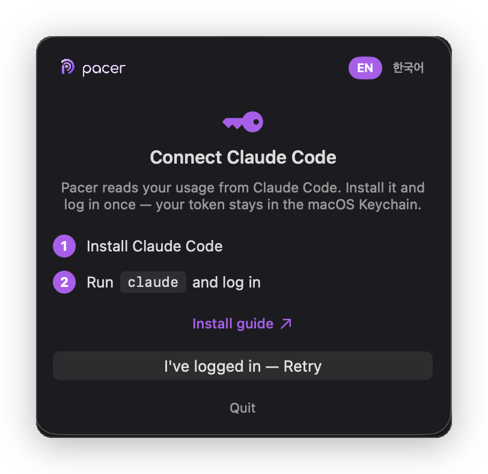

<div align="center">

[🇰🇷 한국어](README.md) · **🇺🇸 English**



# Pacer

### A macOS menu bar app that paces your Claude usage

*Stay in rhythm within your limits* — for Claude Pro / Max


&nbsp;
&nbsp;

</div>

---

## ⚡ Quick install

**Install with one line.** Pacer is unsigned, so a browser-downloaded `.dmg` is blocked by macOS Gatekeeper — but a curl'd file isn't quarantined, so this downloads and installs to `/Applications` in one go:

```sh
osascript -e 'quit app "Pacer"' 2>/dev/null; M=$(mktemp -d) && curl -fsSL https://github.com/codedooly/claude-pacer/releases/latest/download/Pacer.dmg -o /tmp/Pacer.dmg && hdiutil attach -nobrowse -quiet -mountpoint "$M" /tmp/Pacer.dmg && rm -rf /Applications/Pacer.app && cp -R "$M/Pacer.app" /Applications/ && hdiutil detach -quiet "$M" && open -a Pacer
```

> This command **installs and updates** — just re-run it for new versions (quits the old app → replaces → relaunches).

> Requires [Claude Code](https://claude.com/claude-code) installed & logged in → [Requirements](#requirements) below · building from source → [Install](#install)

---

## Requirements

Pacer runs on top of the **Claude Code CLI** — end users installing the app **don't need Xcode.**

| | What you need |
|------|----------|
| **Run** (install dmg) | macOS 14+ · [Claude Code](https://claude.com/claude-code) installed & logged in · Claude Pro / Max subscription |
| **Build** (from source) | the above + full Xcode · `xcodegen` · `create-dmg` (Homebrew) |

> Claude Code handles the usage token (Keychain), ping firing, and Cloud routine registration, so it's required. Without a token the app shows the onboarding screen. (Claude Code itself runs on Node.js.)

---

## Do you know **when** Claude's 5-hour limit actually starts counting?

> I'd used Claude for months — and only just found this out.

Most people think it's a **credit that auto-resets every 5 hours**. It isn't.

- The 5-hour window starts **the moment you send your first message.**
- After it expires, if you don't use Claude, the window **goes to sleep.**
- The countdown **doesn't even begin** until your next first message (or ping).

So **when you start** decides how many *fresh 5-hour windows* you get in a day.

### That's why you ping

Start at 9am and the window is `09:00–14:00` — pile work into the afternoon and you hit the wall right after 2pm.
But **schedule pings at 08 / 13 / 18**, and a fresh window opens at each — so after lunch and in the evening you **start fresh**.

<div align="center">
  
</div>

> **Your weekly total stays the same.** Pacer doesn't give you more — it **aligns your 5-hour flow to your core hours** so you use *the same amount, better.*

---

## At a glance

|  |  |
|---|---|
| **Usage gauges** | 5-hour · 7-day limits as donut gauges — reset countdowns (clock icon) + `Plan: Max (5x)` badge |
| **Ping calendar** | This month's ping history, color-coded by status — `Sent` filled dot, `Auto` outline dot, `Failed` ✕, `Missed`/`Pending` |
| **Usage heatmap** | Per-day peak by 5-hour slot, displayed as a density heatmap |
| **Auto-align** | Choose Local (launchd) or Cloud (Routine) to fire pings on schedule |

| Pace tab | Usage tab |
|---|---|
|  |  |

| Settings — Cloud | Settings — Local |
|---|---|
|  |  |

---

## Why "ping"?

It comes from **sonar** — a short pulse a submarine sends to sense what's around it. Pacer's ping is the signal that *opens a fresh 5-hour window*. Like a **pacer** in a marathon keeping you on rhythm, Pacer keeps your usage on pace.

---

## Ping mode: Local vs Cloud

Choose **Cloud** if you want pings to fire even when your Mac is off. Choose **Local** if Pace log accuracy and weekend/holiday skipping matter more.

| Feature | Local (launchd) | Cloud (Routine) |
|---------|:--------------:|:---------------:|
| Fires when Mac is off | ✗ (Mac must be on) | ✓ (fires from Anthropic's cloud) |
| Pace log accuracy | ✓ Exact (PingRunner records directly) | △ Approximate (inferred from `resets_at` in usage API) |
| Skip weekends & holidays | ✓ (Korean holidays via local lunar calendar) | ✗ (fires daily — cron can't filter specific dates) |
| How pings are automated | launchd LaunchAgent | Claude Routine — Pacer runs its bundled instructions via `claude -p` to auto-register a RemoteTrigger |
| Mode switch takes effect | Immediately (launchd reinstalled) | When you tap **Done** — routine registered/deactivated (a few seconds) |
| Requires Claude Code (claude CLI) | ✓ (to fire pings) | ✓ (to register routine and fire pings) |

---

## How it works

### Usage data

Reads your Claude Code login token from the macOS **Keychain** and calls the usage API. The token never leaves your machine (read-only — Claude Code handles refreshing); the **usage data is polled every 15 minutes**.

### Window alignment — Local mode

A launchd LaunchAgent fires `claude -p "ok"` at your scheduled times to open a fresh 5-hour window. Weekends and Korean public holidays are skipped — holidays are computed locally via the **lunar calendar** (no external API). Because a sleeping Mac won't fire pings, Settings provides a one-click copy of `sudo pmset -c disablesleep 1` to keep your Mac awake while plugged in.

### Window alignment — Cloud mode

Pacer runs its bundled routine-registration instructions via `claude -p` to **automatically register a Claude Routine (RemoteTrigger cloud cron)**. Registration typically takes ~15s (up to 60s), with a countdown shown in Settings. Once registered, Anthropic's cloud fires pings at the scheduled times — even when your Mac is off. Weekend/holiday skipping is not possible due to cron limitations. Pace log timestamps are approximated by inferring `resets_at` jumps from the usage API.

Routine status (registered / disconnected / needs renewal) is detected automatically on app launch and whenever you open Settings. If the Routine is deleted from the web or expires, the mode chip turns **gray ("Check required")**.

### Routine instructions (bundled)

The instructions that register/update the routine are bundled inside the app and run directly via `claude -p` — **nothing is installed** into your `~/.claude/skills` (fully self-contained).

### Cloud setup & troubleshooting

Usually you just pick **Cloud → Apply** and Pacer auto-detects your environment ID and registers. If it gets stuck:

| Symptom | Fix |
|---------|-----|
| "no cloud environment" keeps showing | **Open claude.ai/code** → sign in / create an environment (once) → Apply again |
| `404 not_found · model` | Update Claude Code (`claude`) |
| Usage 0% / "Couldn't update" | Run `claude` once in a terminal → Refresh |

Full setup & troubleshooting → **[docs/cloud-setup.md](docs/cloud-setup.md)**

---

## Menu card

- **Top bar**: wordmark + Pace / Usage tab toggle
- **Mode chip**: Local=green / Cloud active=blue / Cloud disconnected=gray (`Check required`)
- **Plan badge**: `Plan: Max (5x)` (Claude orange)
- **Donut gauges**: 5-Hour · 7-Day — with reset countdown (clock icon)
- **Bottom buttons**: Refresh · Settings · Quit
- **Right-click menu** (menu bar icon): Refresh · **Update** (self-update to the latest dmg) · **Help (About)** · Settings · Quit (Refresh/Settings disabled before login)
- **About panel**: version · license · source link + **check for updates** (compares with the latest GitHub release → in-app update if newer)

**Pace tab**
A monthly calendar of ping history, color-coded by status:

| Status | Display |
|--------|---------|
| `Sent` | Filled dot — recorded directly by PingRunner |
| `Auto` | Outline dot — inferred from usage `resets_at` (Cloud mode) |
| `Failed` | ✕ |
| `Missed` / `Pending` | Empty |

Weekends appear in red/blue; public holidays are dimmed.

**Usage tab**
A density heatmap of your 5-hour slot peaks per day — see at a glance which time blocks you use most.

---

## Install

> Just want to use it? The **⚡ Quick install** (download) above is all you need. This section is for **building yourself / contributors** — native app, no Python, no SwiftBar. Swift / SwiftUI (`MenuBarExtra`).

**Build & run from source**

```sh
git clone https://github.com/codedooly/claude-pacer.git
cd claude-pacer
brew install xcodegen
xcodegen generate
xcodebuild -project Pacer.xcodeproj -scheme Pacer -configuration Release -derivedDataPath ./build build
open build/Build/Products/Release/Pacer.app
```

**Build the dmg yourself** — produces the artifact for Releases (xcodegen + xcodebuild + create-dmg)

```sh
./scripts/build-dmg.sh      # → build/Pacer.dmg
```

On first run macOS may prompt for **Keychain access** → **Always Allow**. (Unsigned, so a *downloaded* dmg needs **right-click → Open** the first time.)

### Onboarding

If no Claude Code token is found in Keychain, the app shows a **"Connect Claude Code"** screen. Install and log in to Claude Code first, then relaunch the app.

<div align="center"></div>

---

## Settings

Changes take effect when you press the large **Apply** button below the Local/Cloud tabs. Closing with **X** discards any unsaved changes.

| Setting | Description |
|---------|-------------|
| **Language** | English / 한국어 toggle (also shown next to the wordmark in onboarding) |
| **Ping method** | `Local` / `Cloud` segment — only one active at a time to prevent duplicate pings |
| **Ping times** | Up to 5 per day — each ping must be at least **+5 hours after the previous one** |
| **Launch at login** | Registers/removes a LaunchAgent |
| **Reset to defaults** | Restores all settings to factory values |

**Local-only options**

| Setting | Description |
|---------|-------------|
| Skip weekends | Skip Saturday and Sunday |
| Skip holidays (KR) | Skip Korean public holidays via local lunar calendar |
| Keep Mac awake | One-click copy of `sudo pmset -c disablesleep 1` |

**Cloud-only options**

| Setting | Description |
|---------|-------------|
| Routine status | Registered / Disconnected / Needs renewal — auto-detected on launch and Settings open |
| Re-register | Delete and re-register the Routine |
| Refresh | Update the Routine when ping times change |
| Open web | Open the Claude Routine management page |
| Environment ID input | If auto-detect finds 0 triggers, a field to paste your env ID from `/schedule` |

---

## Disclaimer

Pacer is an **independent project, not affiliated with Anthropic**. It uses an **undocumented** usage endpoint with your own account token, so it may break if the API changes — but it **fails gracefully** (keeps your last values). A clean-room implementation; no code from other usage tools.

---

## License

[MIT](LICENSE) © 2026 codedooly
